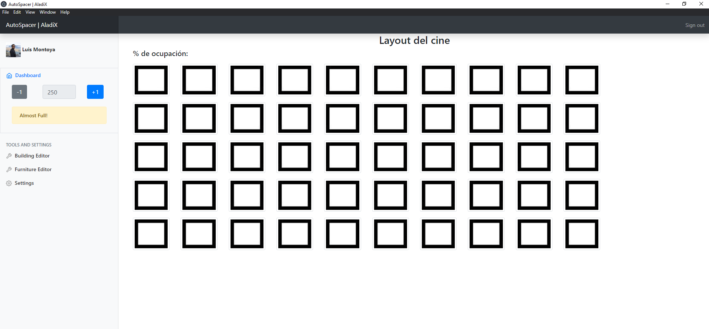

# AutoSpacer - AladiX

> This is a small application in electron that calculates de distribution in a cinema according to pandemic capacity restrictions.

It has an interface that allows users to reserve seats. It also calculates the maximum number of people that are able to enter the cinema.



## Features

* Online Authentication
* Profile retrieval
* Database features

## Requirements

* Electron
* npm

## Running
1. Clone repository and open in shell
2. Install App
```sh
$ npm install
```
2. Start App
```sh
$ npm start
```


## Meta

* **Luis M.**           - [GitHub](https://github.com/lemontyc)
* **Ivan O.**           - [GitHub](https://github.com/scanf30)  
* **Alejandro L.**      - [GitHub](https://github.com/alejandrolzvz)


Distributed under the MIT License. See ``LICENSE`` for more information.

This project was developed for the **MTY Hackathon 2020** .

